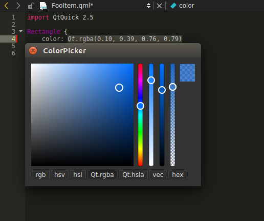

ColorPickerPlugin for QtCreator
===============================

A color picker plugin to easily insert and modify colors in QtCreator's text documents, inspired by Adobe Brackets.

Features
-----------------

- Supports the following color formats : `rgb`, `hsv`, `hsl`, `QML`, `GLSL` and `hex`.

Settings
-----------------

- Available formats can only be those supported by the current text editor. For example, the dialog only proposes `Qt.rgba` and `Qt.hsla` formats if you're editing a `QML` file.

- There are two ways to insert a color in the current text editor : you can press the `Return` key or just change the color or the format in the color editor.

Build the plugin
-----------------

Put the folder `colorpicker` in `<QtCreatorSourcesDir>/src/plugins/`.

Now open `<QtCreatorSourcesDir>/src/plugins.qbs` with your favorite text editor and add the project file to the reference list (something like `"colorpicker/colorpicker.qbs"`).

Build QtCreator. That's it.

How to use it ?
----------------

Open the `Tools` menu and trigger the action `ColorPicker | Trigger Color Edit`, or use `Ctrl + Alt + C`.

Please note
-----------------

- This plugin requires C++14 and  is developed for QtCreator >= 4.0.0.

- I use Qbs rather than QMake. It seems that there's currently no way to develop a plugin without having the whole QtCreator project opened.

- WIP !
